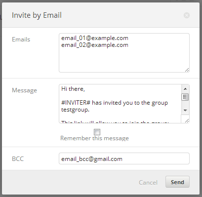
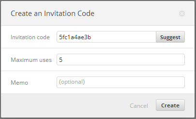

Koding Groups are a core feature of Koding, and allow for a lot of versatility
in group programming. It allows your development and team communication
to be in one area, and even sharing the same machines if you use Shared
VMs.

This guide will go over the concepts of Koding Groups, and how to manage
one.

## What are Groups?

Groups give you and your team a section of Koding to be productive. The
activity feed of your group can be public or private and you can even make
[Shared VMs](#shared-vms)!

They are being designed for large and small team collaboration, and have the
ability to support any number of users. Even the default Koding feed, is a
Group.

## Group Invitations

Since groups can be private, you have multiple avenues to invite team
members. The different ways you can invite are in place to support many
different types of teams. Lets go over each type of invitation real quick.

All invites can be found from from your Group Dashboard *(
`https://koding.com/<group-name>/Dashboard`)*. To find this, go to your
group, and on the left side select *"Group"*. You will then be directed to
your Dashboard. Select Invitations.

### Email

Invitation by email allows you to target any number of members by sending
them unique invites via email.

Enter in any number of emails, one on each line. You can also modify the
email contents that are sent to each of the emails. Make sure to include
the `#URL#` variable! This allows them to actually join with the
invitation link.

After you are satisfied with the email and recipients, click send. An example
image is below

### Invite Codes

Invite codes can be a link, or a code entered upon visiting the group. They
have a customizable limit on how many uses a code can be used as well.

To create a code, simply go to the *"Invitation Codes"* tab, and press the
*"Create Invitation Code"* button. You can now use the generated code or
make your own, as well as explicitly define how many times this code can
be redeemed. An example image is below.

### Invitation Requests

Lastly, if you have your Group set up, users can simply request access.
You can then approve requesters one by one, or in bulk.

## Group Settings

## Group Permissions

## Shared VMs

