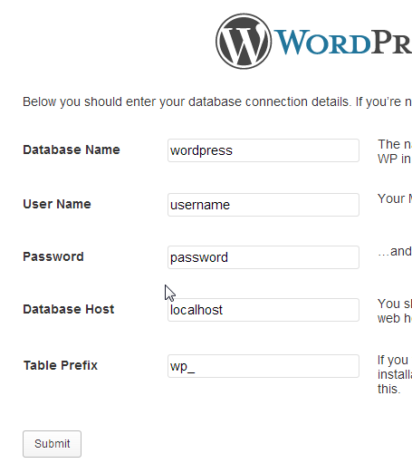

In this tutorial, we will we will go over the basics of getting WordPress
installed on Koding. Note that this is the same as on Ubuntu/etc, but
some users requested this :)


**Reminder**: As with all of these tutorials, they assume that there are no
conflicts. If you have previously attempted to install this software please
remove it fully or understand that conflicts may occur. Thanks :)


## Video

The following is an instructional video which approximately
mirrors the steps below.

<iframe width="680" height="450" src="//www.youtube.com/embed/gJurcN1Vgws" frameborder="0" allowfullscreen></iframe>


## What you will need

You will need to know a few things for this tutorial:

- Your Koding password *(which is also your Root pass)*
- Your VM Connection URL
- Your MySQL Root Username
- Your MySQL Root Password

You will also need to have MySQL previously installed. If you need to
install MySQL please check out
[this tutorial](/docs/guides/installing-mysql-phpmyadmin/).


## Steps for Installation

In this tutorial we are going to start from a fresh installation, and
install it into the root folder.

1. We'll start by downloading and untaring WordPress into ~/wordpress,
  with the following command:
  `curl wordpress.org/latest.tar.gz | tar xz`

2. Next, we'll backup the `~/Web` directory, and replace it with `~/wordpress`
  with the following command:
  `mv Web Web.bkp && mv wordpress Web`

3. Next, we're going to set the `chmod` of the directory so that Wordpress
  can write its only configuration file. To do that, run:
  
  `chmod 777 Web`

4. By default, php5-mysql is also missing, so to install that enter:
  `sudo apt-get install php5-mysql`

5. If you already have a database and MySQL user setup, you can skip this step.
  If not, we need to create a MySQL database and a MySQL User for wordpress.
  
  First, login to mysql with your Root User with:
  
  `mysql -uroot -p`
  
  Enter your MySQL Root password at the prompt. Reminder, this is your MySQL
  Root password, *not your Koding password*.
  
  Now you should be logged into MySQL, and your prompt should look like
  `mysql> `. We will need to type three commands, all of which you can
  copy and modify. Take care to replace `<dbname>` with the name of the
  database you would like Wordpress to use, same for `<wpuser>` and `<wppass>`.
  The commands are:
  
  1. `CREATE DATABASE <dbname>;`
  
  2. `GRANT ALL PRIVILEGES ON <dbname>.* TO "<wpuser>"@"localhost" IDENTIFIED BY "<dbpass>";`
  
  3. `FLUSH PRIVILEGES;`
  
  An example of what this might look like if i created the database
  `wordpress` with the username `wpusername` and the password `wpuserpass`
  can be seen below:
  
  ```
  leeolayvar@vm-0:~$ mysql -uroot -proot
  Welcome to the MySQL monitor.  Commands end with ; or \g.
  Your MySQL connection id is 48
  Server version: 5.5.31-0ubuntu0.13.04.1 (Ubuntu)
  
  Copyright (c) 2000, 2013, Oracle and/or its affiliates. All rights reserved.
  
  Oracle is a registered trademark of Oracle Corporation and/or its
  affiliates. Other names may be trademarks of their respective
  owners.
  
  Type 'help;' or '\h' for help. Type '\c' to clear the current input statement.
  
  mysql> CREATE DATABASE wordpress;
  Query OK, 1 row affected (0.01 sec)
  
  mysql> GRANT ALL PRIVILEGES ON wordpress.* TO "wpusername"@"localhost" IDENTIFIED BY "wpuserpass";
  Query OK, 0 rows affected (0.00 sec)
  
  mysql> FLUSH PRIVILEGES;
  Query OK, 0 rows affected (0.00 sec)
  
  mysql>  
  ```
  
6. We're almost done! Now we can navigate to our WordPress config setup.
  To do this, navigate to our VM Connection url *(eg: http://username.kd.io,
  http://vm-1.username.kd.io, etc)*. Next, press the **"Create a
  Configuration File"** button, then the **"Lets Go"** button and
  you will be presented with your configuration options.
  
  Enter in the database, wpuser, and wppass that we created above and press
  submit. You can leave the database host as `localhost` and the table prefix
  as `wp_`. An example of this filled out with the information from my above
  example is below.
  
  
  #### Possible Gotcha: Sorry, but I can’t write the wp-config.php file.
  
  If you receive the following message after pressing submit, your `chmod`
  is incorrectly configured. Please revisit Step 03, then retry
  this step.
  
  #### Possible Gotcha: Error establishing a database connection
  
  If you receive an error establishing a database connection, ensure
  that your host is localhost, and your database name, username, and pass
  are correct. If you need to revisit Step 05 you can, then revisit this
  step.
  
7. All right sparky! If you have successfully received the message starting
  with *"All right sparky!"* then you're good to go! Your WordPress
  is ready to be installed via the automatic configuration. Press **Run
  the install** and proceed with the normal WordPress installation.
  


## Confirming your Installation

After Step 07, you can confirm your working WordPress by simple visiting
your connection url *(eg: `http://username.kd.io`)*. You should be
redirected to `/wp-admin/install.php` and can continue with the setup.


## Update WordPress and plugins

If you need to update WordPress and its plugins or themes you can use `localhost` as the **Hostname**, `your Koding username` as **FTP Username**,
`your Koding password` as **FTP Password** and you can leave `FTP` as **Connection Type**

## Additional Resources

- [WordPress.org](http://wordpress.org/)
- [WordPress Download](http://wordpress.org/download/)


