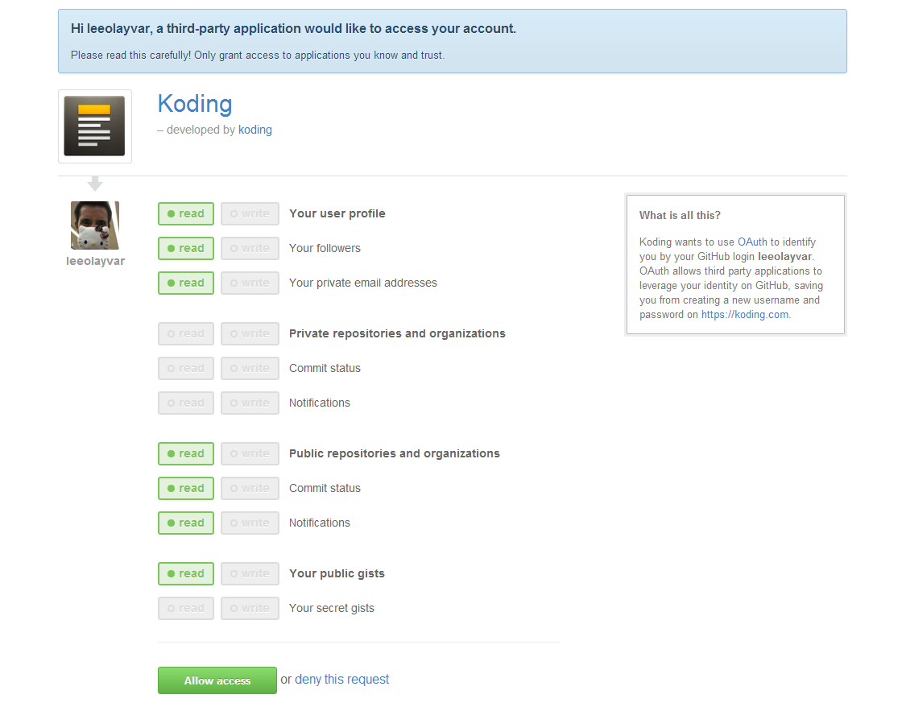

In this short guide we will go over linking your Github Account to
your Koding Account.

What does this do? Linking your Github Account means that if you are already
logged into Github, you can simply login to Koding with one click!

## Video

*(Coming Soon)*

## What you will need

You will need a [Koding][0] Account and a [Github][1] Account. That's it!

## Linking Github

1. Go to your [Koding Account][2] page, and look for the **Linked Accounts**
  section.

2. There will be a link in the middle that says **Link Now**. Click this.

3. A window will popup. This window is Github asking you if you would like
  to allow *read only* access to your Github account, to Koding.
  
  Click **Allow Access**. An example image is below.
  
  

4. That's it! The window will close, and your account will now be linked.
  
  Now, whenever you are logged out and need to login, simply click the
  **Sign in with Github** button *(which is the little Github Icon)*.
  An example of this is below.
  
  

## Additional Resources

- [Koding][0]
- [Koding Account][0]
- [Github][1]

[0]: https://koding.com
[1]: https://github.com
[2]: https://koding.com/Account

