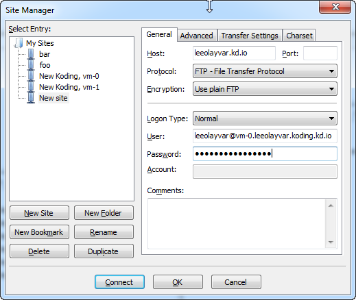

In this tutorial, i will go over how to get your FTP Client connected
to your VM's FTP Server. I will cover both App Installation, and Manual
installation of your VM server, as well as the basics of the FTP Client
settings. In this guide, we are using
[FileZilla](https://filezilla-project.org/) as the FTP Client.


**Reminder**: As with all of these tutorials, they assume that there are no
conflicts. If you have previously attempted to install this software please
remove it fully or understand that conflicts may occur. Thanks :)


## Video

The following is an instructional video which approximately
mirrors the steps below. It covers both App, and Manual,
installations.

<iframe width="680" height="450" src="//www.youtube.com/embed/1Boyf-vYXUI" frameborder="0" allowfullscreen></iframe>


## What you will need

In this tutorial you will need three things. Your Koding username,
Koding password, and your VM Number.

To find your VM number, open your terminal for the VM you wish to install
PureFTPd on, and look for the *username@vm-0:~$*, where *vm-0*, *vm-1*,
*vm-2*, etc, is your vm number. This will be needed, to connect to your
PureFTPd server.


## Steps for Installation with Koding App

The Koding App installation is the installation that most people will want.
It's the easiest, but will only work for your first VM currently. If you
need to install
PureFTPd
on any VM other than your first, please see the Manual Installation
section below.

1. First, we are going to go to the
  [koding/Apps](https://koding.com/Apps) listing, and click the
  [PureFTPd Installer](https://koding.com/Apps/pureftpd-installer). Next,
  click the **"Install Now"** button in the upper left.

2. Next, now that you have added the PureFTPd Installer App to Your Apps,
  click on the
  [PureFTPd App](https://koding.com/Develop/PureFTPd%20Installer)
  in Your Apps. Once it loads, in the upper right corner click
  the **Install** button.
  
  A terminal will now popup in the lower section of the App. This is where
  we will be handling the rest of the commands for this installation.

3. Enter your Koding password, which is your root password.
  
  #### Possible Gotcha: Unmet Dependancies?
  
  If, after entering your password, you run into a screen that looks like this:
  
  
  Type in the following command
  
  `sudo apt-get -f install`

  Once the command has finished executing,
  click the **Install** button in the upper right again. You should
  not run into this a second time. Proceed to the next step after clicking
  the **Install** button.
  
4. If a bunch of text whizzes by with no visible errors, Congratulations!
  You now have a working FTP server on this VM! Next up, we need to connect
  to our FTP Server with our FTP Client!
  
  To do this, we are going to open up FileZilla and press **Ctrl-S**, to open
  up our site manager. You can also open this by going to
  **File -> Site Manager**. When the Site Manager pops up, click the
  **"New Site"** button.

5. Now, the last step is to enter our PureFTPd information! Enter the following
  information into your New Site. Replace `<username>` with your username,
  and `<vm-Number>` with your VM Number; So that `<vm-Number>` becomes *vm-0*,
  *vm-1*, etc.
  
  ```
  Host: <username>.kd.io
  Encryption: Use plain FTP
  Login Type: Normal
  User: <username>@<vm-Number>.<username>.koding.kd.io
  Password: <your koding password>
  ```
  
  The FTP Username, when filled out, should look like
  `leeolayvar@vm-0.leeolayvar.koding.kd.io`. Make sure the end looks
  like *koding.kd.io*, it is important.
  
  If you have any confusion about where to enter this information,
  please refer to the video or the image below.
  
  


## Steps for Manual Installation

Installing PureFTPd is probably the easiest "manual" installation there is.
It is just one command, and the rest is identical to the App Installer above.
So after Step 1, refer to the above steps. The video also covers this
installation, in basic detail.

1. Install the PureFTPd apt-get package, by entering the following command:
  `sudo apt-get install pure-ftpd`
  
  Then proceed to Step #3 in the above Koding App Installation steps.


## Confirming your Installation

Connecting to your FTP Server with your FTP Client is the easiest way
to confirm it is working, but what if that fails? Is your Server running?

To find this out, run the following command: `ps aux | grep ftpd`. This
will print the running processes that contain the text "ftpd". What you are
looking for, is a line containing **"PURE-FTPD (SERVER)"**. If you see that,
your server is running, and the problem is likely not your server.


## Additional Resources

- [FileZilla](https://filezilla-project.org/)
- [FileZilla Download](https://filezilla-project.org/download.php?type=client)

