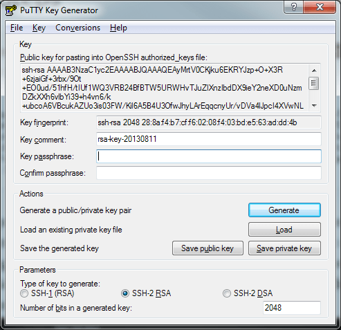
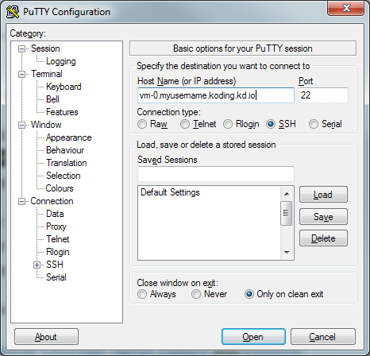
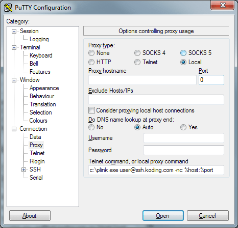
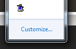
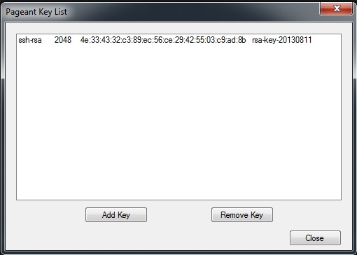
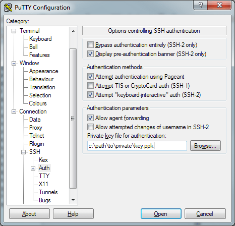
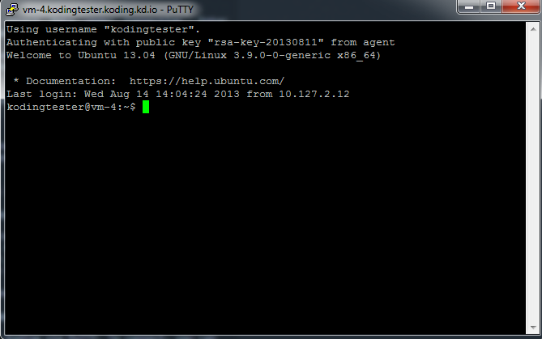

In this tutorial, we will go over the steps to SSHing into your VM! This
is a semi-experimental tutorial, so if you have any problems please make
sure to
[submit an issue][1]
and we can help make this a rock solid tutorial for all skill levels :)

Note that we will only be covering Unix based OSs. If someone wants to
give me information on how this can be done on Windows, i'll be happy
to add a windows section!

**Reminder**: As with all of these tutorials, they assume that there are no
conflicts. If you have previously attempted to install this software please
remove it fully or understand that conflicts may occur. Thanks :)


## Video

The following is an instructional video which approximately
mirrors the steps below. It covers both App, and Manual,
installations.

<iframe width="680" height="450" src="//www.youtube.com/embed/9tsmL61HgXU" frameborder="0" allowfullscreen></iframe>


## What you will need

In this tutorial, i am going to use the terminology of "Home" and "Koding"
machines. Home being whatever the machine you are using to connect to
Koding with. Koding being the machine that is receiving the connection.
`Home -> Koding`.

On the home machine, you will need a public rsa key *(usually found
in `~/.ssh/id_rsa.pub`)*. If you need to generate one, please
[refer to the Github tutorial on this](https://help.github.com/articles/generating-ssh-keys).
You will also need your Username, and your VM Number.

To find your VM number, review the [Find your VM Number][0] guide.


## Tutorial Steps for OpenSSH on Linux

1. First, copy your Public Key, usually found in `~/.ssh/id_rsa.pub`, and copy
  it in it's entirety! It will look something like this:
  
  ```
  ssh-rsa AAAAB3NzaC1yc2EAAAADAQABAAABAQCyhKankDE4DRM86JqZ3JPdWDeqg+TbzlqlTLf
  OKTeokhRoMgy5WoMY/ZWUVES3d2vSHHwW3cwWlELmVdc3Ow57boZv3fOsPhybYHVRTClXYr1ncS
  xyTvjvCfvV5q22aIxHPWQ353543ssda87sa+85XEa4VnveJsEzxBZl4oJ4GB0AGa48+UdIqutrg
  Zu7D7JCK+Yl228X+3bJf3ddlqDaKaVXPivvvYqImK6ZwFsxh2lNO4E8IOd3OSK9zv6i+io8PxWm
  wP0tLFokxulAI8Td1sOPBE9s9bdJ5c2T/GfGjKF+aNKsd33TsYEjjc/plMZmRRrOgQwre6OAkgM
  vyV2X foo@bar.baz
  ```
  
2. Next, paste this entire Public Key into your SSH Keys section of your
  Account settings. This can be found by going to
  [koding/Account](https://koding.com/Account) and clicking SSH Keys
  under the DEVELOP. Click the Plus button on the right side of the page,
  and paste your Public Key into this. Below is a screenshot of this area
  for clarification.
  
  
3. Now go back to your Home machine, and create the file
  `~/.ssh/config` *(assuming it's not already created)*. Add the following
  code into that file:
  
  ```
  Host *.kd.io
    User <username>
    ProxyCommand ssh %r@ssh.koding.com nc %h %p
  ```
  
  Where `<username>` is your username, without the `<>`.
  
4. Next, on your Home machine and connect to your VM! This can be
  done by typing: `ssh <vm-Number>.<username>.koding.kd.io`. An example,
  here is my connection command: `ssh vm-0.leeolayvar.koding.kd.io`.
  
  You will have to enter your local SSH password, if you chose one when you
  created your key. After that, presented with `username@vm-X:~$`, singaling
  that you have connected successfully.
  
  This step has quite a few Gotchas so please review them below.
  
  Two likely gotchas, are
  [Possible Gotchas: Agent Failure](#agent-admitted-failure?)
  and
  [Possible Gotchas: ssh_exchange_identification](#ssh_exchange_identification-/-keep-koding-open-in-browser)
  below.
  
  ### Error: Could not chdir
  
  This "error" can be ignored. I'm not sure what exactly causes it, but
  everyone experiences it and it does not cause any problems.
  [@kiwigeraint](https://koding.com/kiwigeraint) says to simply ignore it. :)


## Tutorial Steps for PuTTY on Windows

For this connection method, you will need the [PuTTY SSH client suite][10].
Including the `putty.exe`, `plink.exe`, and `pageant.exe`.

**Note:** This PuTTY guide has only recently been published. If you are
familiar with PuTTY and you think something should be changed, please
[let me know][1]!

1. Fire up [PuTTYgen][11],
  the SSH key generator for the PuTTY suite. If you already have a private key,
  load it up; otherwise generate a new key pair. You'll end up with some
  gibberish, a fingerprint, and some settings.
  
  
  
2. Copy the gibberish (your public key) to the SSH Keys section of [your
  account](https://koding.com/Account), as in
  [Step #2 above](#tutorial-steps-for-openssh-on-linux).
  Save your private key to someplace accessible; you'll need it later.

3. Start up [PuTTY][11]
  and set the _Host Name (or IP address)_ to the same VM name as above:
  
  `vm-Number.<username>.koding.kd.io`
  
  

4. In the _Category_ menu on the left, select _Data_ under _Connection_. Enter
  your Koding username in the _Auto-login username_ box.

5. Select _Proxy_ under _Connection_, and change the _Proxy type_ to _Local_.
  Enter the following line (modified for your system) in the _Telnet command,
  or local proxy command_ box:
  
  `C:\your\path\to\plink.exe <username>@ssh.koding.com -nc %host:%port`
  
  

6. Go back up to the *"Session"* settings and save this PuTTY
  configuration to a new session by typing a name into the *"Saved Sessions"*
  box, and clicking on *"Save"*.

7. In Step 7, we will cover setting up your Auth. This can be done two
  ways, and we will cover both. **You only need to do one** method!
  Pageant has been working for everyone, where as PuTTY-Auth has been
  a bit problematic but is shorter. Choose whichever you like, but if you
  have issues, try [Pageant Auth](#pageant-auth).
  
  ### Pageant Auth
  
  Open `pageant.exe`. It will launch into your Taskbar.
  
  
  
  Right click the Pageant icon in the taskbar, and select *"View Keys"*. From
  there, click the *"Add Key"* button. Navigate to the **private** key you
  saved from Step 2 and click *"Open"*. You should now have a key listed
  in your Pageant Key List. An example image is below.
  
  
  
  If your key has been added to the Pageant Key List, close the window.
  
  ### PuTTY Auth
  
  Reopen PuTTY and select your Session, then click Load.
  
  Next, under the _Connection_ menu, open up the _SSH_ menu and select _Auth_.
  Enable the _Allow agent forwarding_ checkbox. Under _Private key file for
  authentication_, browse to the private key you saved in Step 2.
  
  
  
  Next, Plink needs to know the explicit location of your key. So go back to
  *"Proxy"* under *"Connection"* and look for the *"Telnet command,
  or local proxy command"* box. Currently, it should look like this:
  
  `C:\your\path\to\plink.exe <username>@ssh.koding.com -nc %host:%port`
  
  Modify it, by adding your private key location. So, it will look like
  this:
  
  `C:\your\path\to\plink.exe -i c:\path\to\private\key.ppk <username>@ssh.koding.com -nc %host:%port`
  
8. You're done! You can now connect to Koding via PuTTY. To connect, you can
  either right click the Pageant Icon and under *"Saved Sessions"*, click
  on your Saved Session.
  
  To connect from PuTTY itself, open PuTTY and select your Saved Session from
  the list, then click Open.
  
  An example of a successful Koding Connection is below.
  
  


### Troubleshooting

If you have trouble connecting, try running the Plink proxy command in `verbose`
mode (`-v`) from a console (outside PuTTY itself). You'll need to manually specify the
private key with `-i`.

`> C:\path\to\plink.exe -v -i c:\path\to\private\key.ppk <username>@ssh.koding.com -nc vm-Number.<username>.koding.kd.io:22`

If it ends with a line resembling `SSH-2.0-OpenSSH_5.9p1` then your connection
should be good, and the problem is likely elsewhere.

## Confirming your Installation

The best way to confirm your installation is simply by connecting to your
Koding VM. For information on this, see Step #3 above.


## Possible Gotchas


### Agent admitted failure?

If you receive an error when you attempt to connect, matching the following
description:

```
Agent admitted failure to sign using the key.
```

Then run the command `ssh-add`. For additional information on this gotcha,
see the
[Github Help Page](https://help.github.com/articles/error-agent-admitted-failure-to-sign)
on the subject.


### ssh_exchange_identification / Keep Koding Open in Browser

Until Always-On VMs are available, Koding will shut down your VM after
approximately ~20 minutes. To ensure that you are able to connect properly
make sure you have your Broser open **and logged in** to Koding.com.

If you experience the following error:

```
ssh_exchange_identification: Connection closed by remote host
```

Your VM being "off" is the most likely culprit. You can ensure it is on by
visiting it's direct url, such as http://vm-0.username.kd.io, and ensuring
you are presented with your Hello World Apache response. If you receive
an error indicating that VM does not exist or is not on, you should have a
good idea why SSH is failing to connect.

If your VM is toggled off, it can be turned on by going to
[koding/Develop](https://koding.com/Develop) and looking for your VM under
**Your Environments**, in the lower left. An image is below for reference:


### ~/.ssh/authorized_keys

You do *not* need to use authorized_keys in the Koding VMs. The
Account Settings -> SSH Keys takes care of the authorization for you.


## Additional Resources

- [Agent Failure Information](https://help.github.com/articles/error-agent-admitted-failure-to-sign)


[0]: /docs/guides/find-your-vm-number/
[1]: https://github.com/koding/docs/issues/new

[10]: http://www.chiark.greenend.org.uk/~sgtatham/putty/
[11]: http://www.chiark.greenend.org.uk/~sgtatham/putty/download.html


